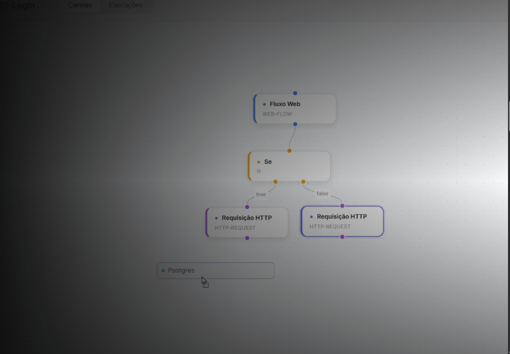
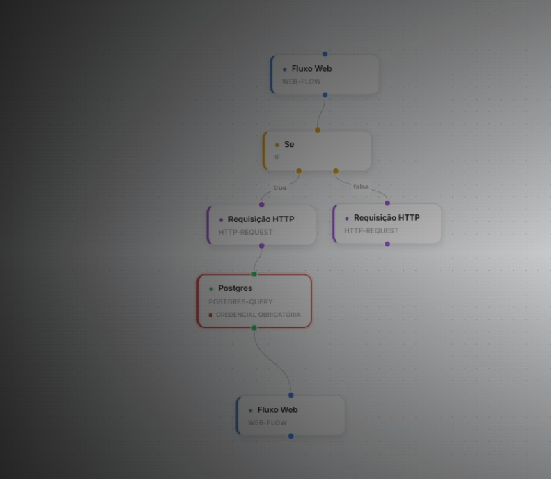
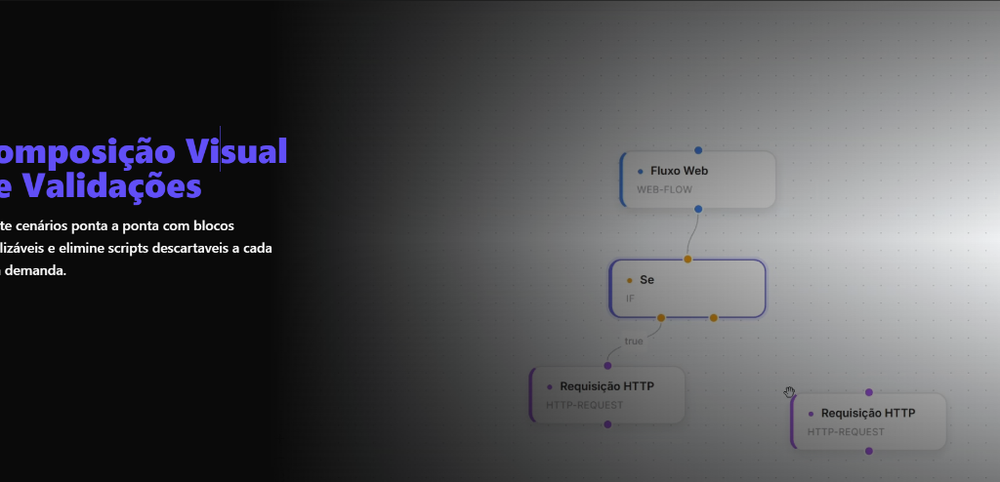
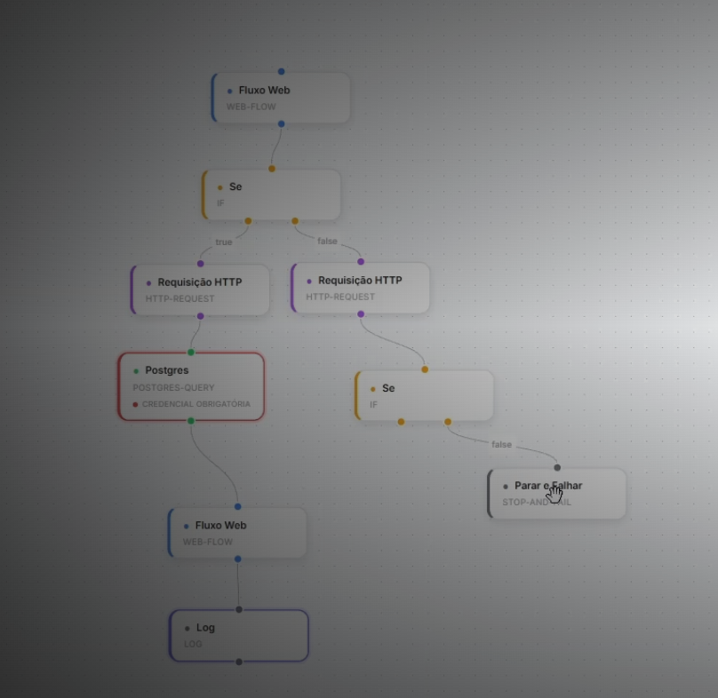

# goState

> Plataforma de nível corporativo para orquestração, execução visual no Canvas e acompanhamento de testes automatizados E2E com Playwright.

goState centraliza todo o fluxo de automação de testes: criação visual interativa via Canvas, gerenciamento de projetos, suites, scripts Playwright, execuções distribuídas, agentes remotos por WebSockets e auditoria. 

O sistema foi redesenhado com uma interface premium e responsiva no tema **Carmesim/Vermelho (Crimson)**, suportando perfeitamente os modos escuro e claro, com um menu unificado de automação.

---

## 📸 Interface & Funcionalidades

### 1. Construtor Visual de Fluxo (Canvas Editor)
Crie testes completos e lógicos simplesmente arrastando e conectando nós (Navegação Web, Consultas Postgres, Requisições HTTP, Desvios Condicionais "IF", Logs e Interrupções).


### 2. Listagem Unificada de Casos de Teste (Automação)
Gerencie todos os seus testes do workspace de forma centralizada. Filtre por Projeto, Suíte de Teste, prioridade, status e tipo de teste.


### 3. Histórico e Acompanhamento de Execuções
Acompanhe os logs em tempo real e verifique o resultado das execuções, incluindo vídeos e capturas de tela dos testes falhos.


### 4. Editor Integrado de Scripts Playwright
Se preferir, digite diretamente seus scripts em JavaScript/TypeScript para execução direta no Playwright.


---

## 🚀 Como Executar o Projeto

### Pré-requisitos
* Node.js (v18 ou superior)
* npm
* Docker & Docker Compose (para execução em containers)

### 1. Clonar o Repositório
```bash
git clone https://github.com/PaulNasc/gostate.git
cd gostate
```

---

### Opção A: Executar Localmente em Desenvolvimento (Sem Docker)

Esta é a forma recomendada para alterar o código e ver as alterações em tempo real.

1. **Instalar Dependências na Raiz (Instala tudo via Workspace)**
   ```bash
   npm install
   ```

2. **Configurar as Variáveis de Ambiente**
   Crie um arquivo `.env` na raiz do projeto (copie de `.env.example`):
   ```env
   # API URL
   VITE_API_BASE=http://localhost:4000
   INTERNAL_BACKEND_URL=http://localhost:4000
   CORS_ORIGIN=http://localhost:5173
   
   DEFAULT_AGENT_TOKEN=gostate-dev-agent-token-local-compose-2024
   ```

3. **Executar Todos os Serviços Simultaneamente**
   ```bash
   npm run dev:all
   ```
   *Este comando sobe simultaneamente: o Backend (porta 4000), o Frontend principal (porta 5173) e o Admin (porta 4001).*

---

### Opção B: Executar Completo com Docker Compose (Modo Produção/Demo)

1. **Configurar as Variáveis de Ambiente**
   Crie o arquivo `.env` na raiz do projeto:
   ```env
   VITE_API_BASE=http://localhost:4000
   INTERNAL_BACKEND_URL=http://backend:4000
   CORS_ORIGIN=http://localhost:5173
   DEFAULT_AGENT_TOKEN=gostate-dev-agent-token-local-compose-2024
   ```

2. **Construir e Iniciar os Containers**
   ```bash
   docker compose up -d --build
   ```

---

## 🔐 Acesso e Credenciais Iniciais

Após iniciar os serviços, acesse os painéis correspondentes:

| URL | Componente | Descrição |
|-----|------------|-----------|
| **http://localhost:5173** | **Frontend (App)** | Painel do Usuário (Projetos, Canvas, Execuções) |
| **http://localhost:4001** | **Admin Console** | Painel Administrativo (Gerenciador de Agentes) |
| **http://localhost:4000** | **Backend API** | Documentação e API Engine |

* **Usuário Admin Padrão:** `admin@gostate.dev`
* **Senha:** `Admin@123`

---

## 🛠️ Estrutura do Monorepo

* `/backend` - Servidor Express, banco SQLite (better-sqlite3) e comunicação em tempo real via Socket.IO.
* `/frontend` - Interface de Usuário moderna em React, Vite, Tailwind CSS e React Flow.
* `/admin` - Painel de administração geral de agentes e configurações de sistema.
* `/agent` - Executor de testes Playwright e Puppeteer com log stream ativo.
* `/docs` - Manuais técnicos e de arquitetura do goState.

---

## 🧪 Rodando Testes Automatizados (Backend)
```bash
cd backend
npm test
```

## 📄 Licença
Distribuído sob a licença MIT. Veja `LICENSE` para mais informações.
